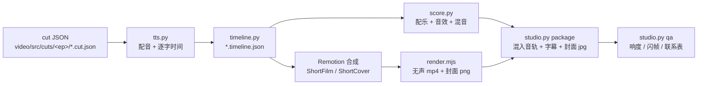

# 01 · 流水线与架构

解说优先：**先有配音，再有画面**。每句话的逐字时间戳决定镜头、标注、卡片和音效的时刻，所以改稿后画面会自动对齐。



一条命令跑完：`.venv/bin/python scripts/studio.py all <ep>`。分步命令见 `scripts/studio.py` 顶部注释。

## 各阶段

| 阶段 | 命令 | 输入 | 输出 | 缓存 |
|---|---|---|---|---|
| 配音 | `studio.py voice <ep> [--cut id] [--provider doubao]` | cut JSON 的 `chapters`、`voice`；`config/voices.json`；`config/pronunciations.json` | `data/tts/<ep>/<cut>/<line>.wav` + `meta.json`（文本、时长、逐字时间 `ct`） | 按“文本 + 音色 + 发音”的 sha1 跳过未变的句子；`--force` 重做 |
| 时间线 | `studio.py timeline <ep>` | cut JSON + `meta.json` | `<cut>.timeline.json`（章节、句子、横竖两套字幕切分） | — |
| 画面 | Remotion 自动注册 | cut JSON + timeline + 路线 | 合成 `<ep>-<id>-v/-h`、封面 `-cover-v/-34/-h` | — |
| 配乐 | `studio.py score <ep> [--cut id] [--remix]` | timeline + cut 的 `audio` | `data/audio/<ep>/<cut>/mix_voice.wav`、`mix_music.wav`、分轨 `stem_*.npy` | `--remix` 只重混不重算分轨 |
| 渲染 | `studio.py render <ep> [--only key] [--covers-only]` | `episode.json` 的 deliverables | `out/<ep>/_build/*.mp4`（无声）、`*.png` | — |
| 打包 | `studio.py package <ep>` | `_build` + 混音 + timeline | `out/<ep>/<序号_版式 · 用途>/` 成片、字幕、封面；`发布清单.md` | — |
| 质检 | `studio.py qa <ep>` | 成片 | `out/<ep>/_qa/report.md` + 联系表 | — |

ep01 的长片是早期代码路径：稿子在 `main.script.json`，画面是 `Film.tsx` + `director.ts`，音效时刻在 `scripts/events.py`。新一期不走这条路（见 `docs/09-new-episode.md`）。

## 代码地图

```
xuanzang/
  config/            voices.json（各配音服务参数） pronunciations.json（统一发音词典）
  scripts/           studio.py（总入口） tts.py timeline.py score.py qa.py export_srt.py
                     fetch_tiles.py extract_rivers.py upscale.py events.py（ep01 长片音效时刻）
  video/src/
    Root.tsx         注册全部合成（长片、封面、所有 cut）
    cuts/<ep>/       cut JSON、timeline、episode.json —— 内容都在这里
    episodes/        types.ts（路线类型） index.ts（路线注册表） <ep>/route.ts
    lib/journey.ts   makeJourney：路线 → 弧长、节点、分段、锚点
    map/             MapScene（MapLibre，地形 + 影像 + 河流 + 路线渐显） tiles.ts（xz:// 本地瓦片协议）
                     MapOverlay（ep01 长片的城市/故事钉/行者组件，短片也复用）
    shorts/          cut 引擎：spec（类型、锚点、镜头、路线插值） build registry
                     Portrait / Landscape（两种版式） OpenCards（片名、章节卡） ShortFilm ShortCover
    ui/              卡片、特效（尘、雪、沙、颗粒、暗角）、字幕、片尾、冷开场
    config/brand.json  频道名、口号、更新频率（全频道共用）
    theme.ts fonts.ts text.ts（预加载所有用到的字形）
  video/public/      img/ img2x/（插画） fx/（颗粒贴图） tiles/（地图瓦片，不进 git）
  docs/              规范与经验（本目录）
  out/<ep>/          交付物（不进 git）
```

## 地图

- 影像：NASA Blue Marble（含海底地形），NASA GIBS 下载，公有领域；最高 z8（约 500 米/像素），更深的缩放由 MapLibre 放大。
- 地形：Terrarium DEM（AWS Open Data），夸张系数 1.65。
- 河流：Natural Earth 10m，`scripts/extract_rivers.py` 抽取并简化成 `video/src/data/rivers.json`。
- 投影：短片和封面用 mercator；ep01 长片在低缩放时用球面（vertical-perspective），近景切回 mercator。
- **不画任何现代国界、行政区划**。现代地名只作为小字注释（`modern` 字段）。

## 资源清单（不进 git 的东西怎么恢复）

| 资源 | 位置 | 恢复方式 |
|---|---|---|
| Python 环境 | `.venv/` | `uv venv --python 3.12 .venv && uv pip install -r requirements.txt --python .venv/bin/python` |
| Node 依赖 + 字体 | `video/node_modules/` | `cd video && npm ci`（字体来自 `@fontsource/*` 包：思源宋体、马善政、志莽行、Cormorant Garamond）。npm 11 提示 esbuild 的 `allow-scripts` 可以忽略，它的二进制来自 `@esbuild/darwin-arm64` |
| 无头浏览器 | `video/node_modules/.remotion/` | 首次渲染时 Remotion 自动下载 chrome-headless-shell |
| ffmpeg | 系统 | `brew install ffmpeg`（打包用 `aac_at` 编码器，需要 macOS 版 ffmpeg） |
| 地图瓦片（约 342 MB） | `video/public/tiles/` | `.venv/bin/python scripts/fetch_tiles.py`（默认范围即 ep01 覆盖范围；`--bbox` 补区域） |
| Natural Earth 河湖 | `data/ne/` | 下载 `https://naciscdn.org/naturalearth/10m/physical/ne_10m_rivers_lake_centerlines.zip` 和 `ne_10m_lakes.zip` 解压到 `data/ne/` |
| Real-ESRGAN 模型 | `data/models/RealESRGAN_x2.pth` | `https://hf-mirror.com/ai-forever/Real-ESRGAN/resolve/main/RealESRGAN_x2.pth` |
| 配音缓存、混音、成片 | `data/tts/` `data/audio/` `out/` | 按流水线重新生成 |
| 密钥 | `.env` | 复制 `.env.example` 填写；**密钥只放 `.env`，不要写进任何 JSON 或代码** |

插画（`video/public/img*`）是生成的、无法逐像素重现，**进 git**。

## 预览与迭代

- 交互预览：`cd video && npm run studio`，浏览器里拖时间轴看任意合成。
- 静帧：`node scripts/stills.mjs --comp <合成id> 3 12 30`（秒），一次打包多张图，最快的检查方式。
- 改了 TS/TSX 先跑 `npm run typecheck`。

## 性能参考（M 系列 Mac）

- 实测（ep01，机器空闲、并发 6）：504 秒长片渲染 + 编码 18 分钟；60 秒竖版短片约 2 分钟；整期 8 条成片 + 16 张封面约 35 分钟。同时跑别的渲染时慢一倍以上（长片 28 分钟）。
- Cursor、Chrome、企业微信、电脑管家等后台程序会明显拖慢渲染；大批量渲染前关掉。
- `render.mjs` 一次打包、复用一个浏览器，顺序渲染列表里的所有合成；并发默认 6，机器忙时用 `--concurrency 3`。
- 渲染开始时就把源码打包了，渲染过程中改源码不影响正在跑的任务。
